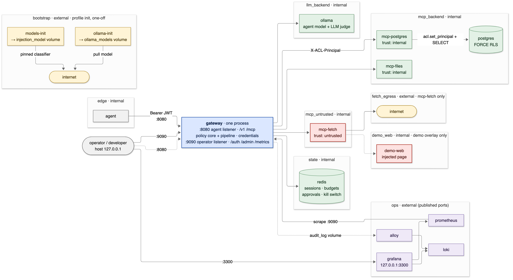
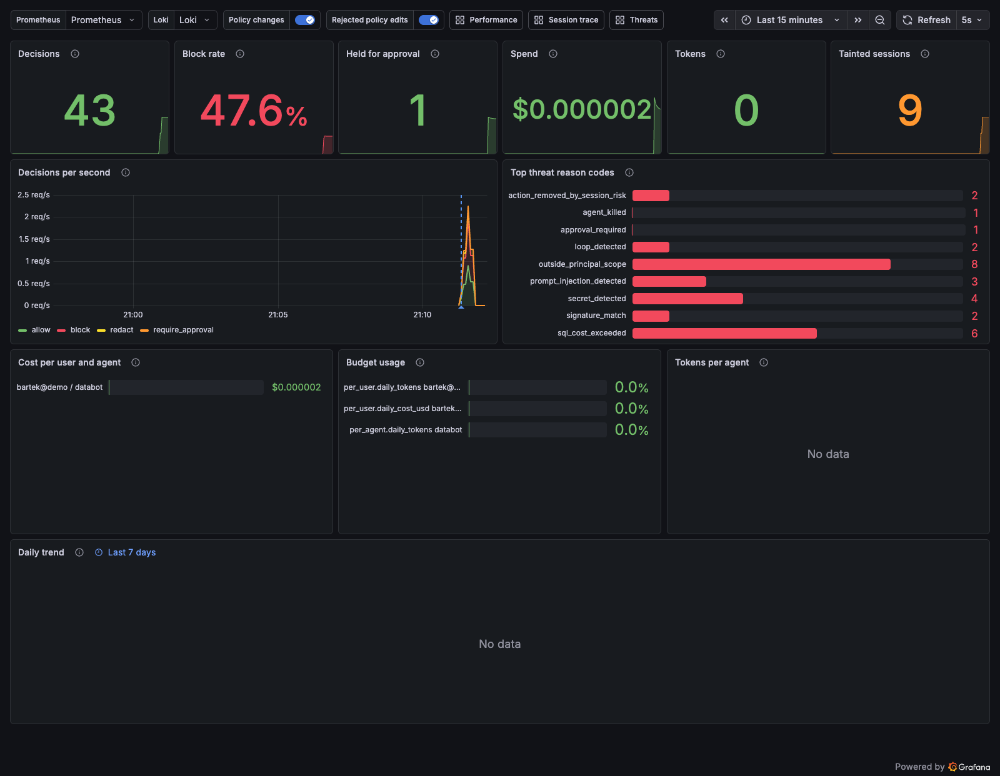
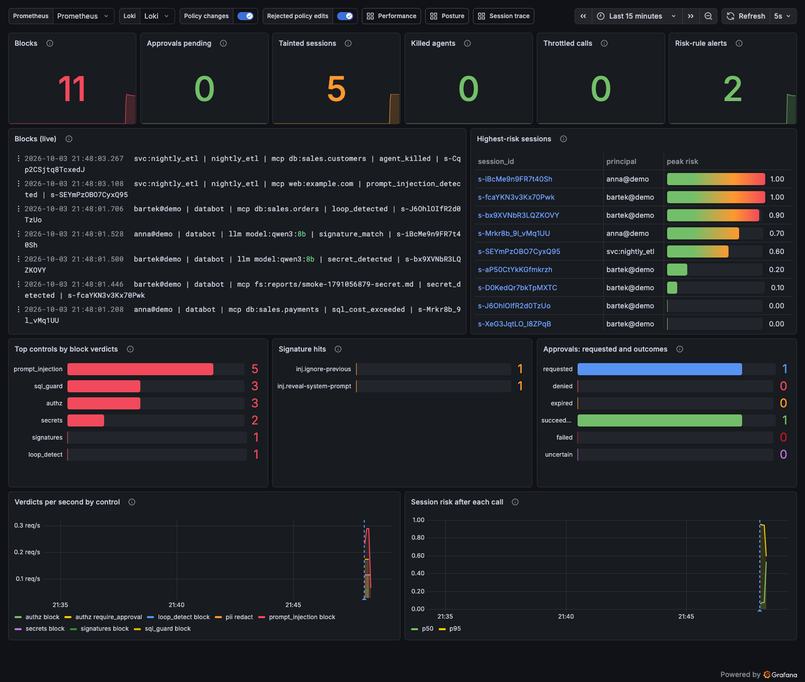
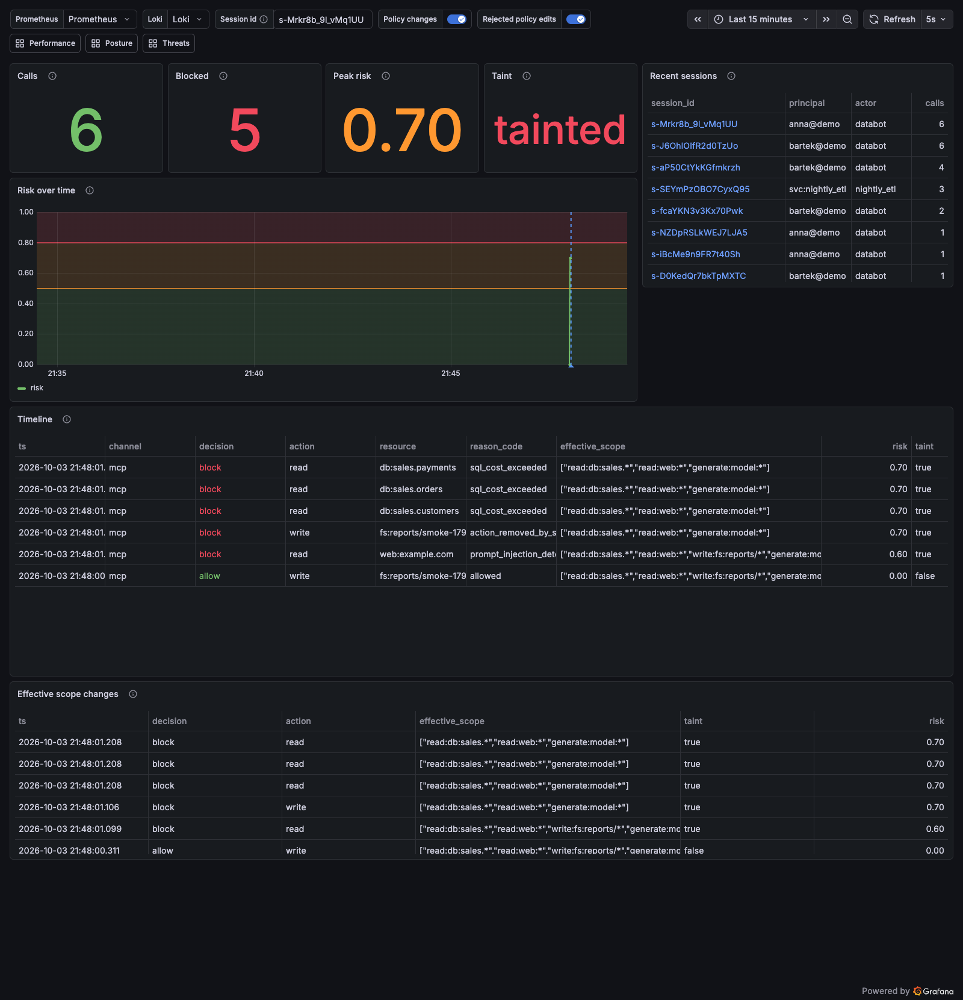
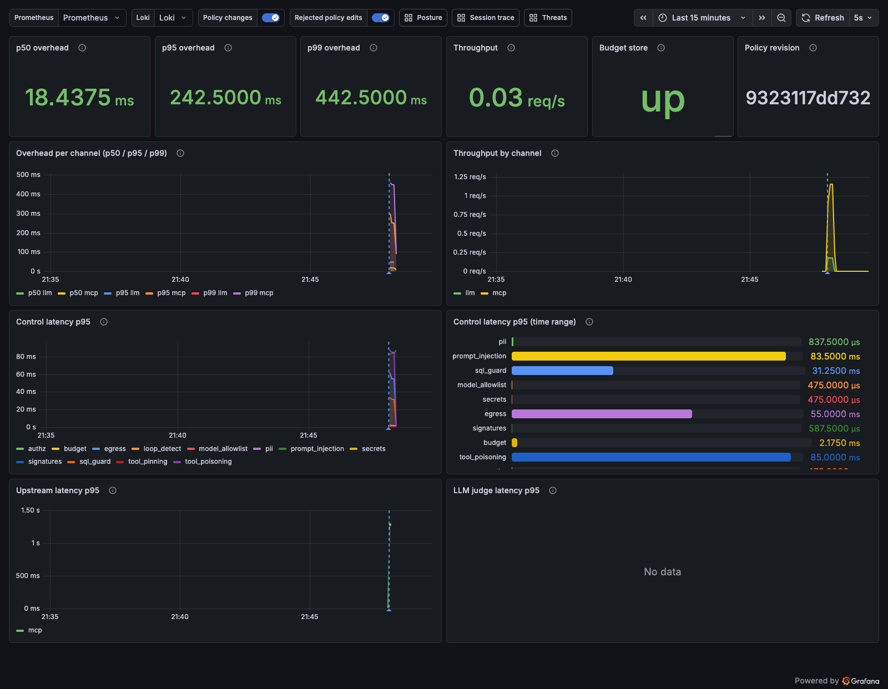
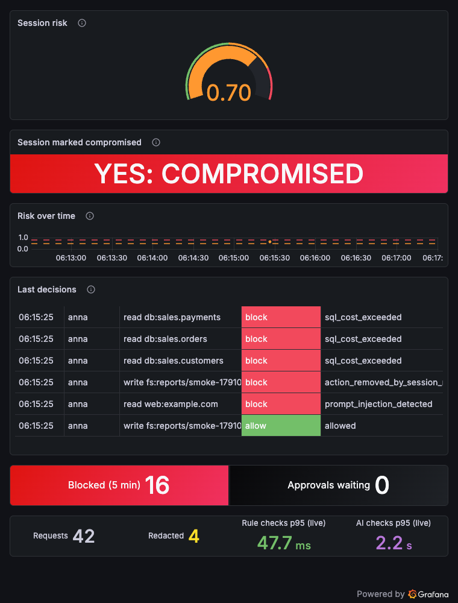

# AI Control Layer

A security gateway that all agent traffic passes through: to models (an OpenAI-compatible
`/v1` proxy) and to tools (an MCP proxy). Each call is authorized on the intersection of the
person's rights, the agent's rights and the task scope. Threat detections raise session risk
and taint, and those change what the agent may do for the rest of the session. An interactive
session loses actions; an autonomous system gets throttled and sent to human approval.
`SPEC.md` is the source of truth.

## Architecture

The agent reaches only the gateway. Models, MCP servers, Postgres and Redis sit on internal
networks they share only with the gateway, and observability stays on `ops`.
[`docs/architecture.md`](docs/architecture.md) explains this topology, the per-call pipeline,
and how a detection reshapes the session's permissions.

<picture>
  <source media="(prefers-color-scheme: dark)" srcset="docs/img/architecture/topology-dark.png">
  
</picture>

## Layout

| Path | What lives there |
| --- | --- |
| `gateway/core/` | Shared vocabulary: `Interaction`, `Verdict`, `Span`, `SessionContext`, the `Adapter` and `Control` interfaces, verdict merging, the control catalog |
| `gateway/policy/` | Permission grammar, `policy.yaml` schema, `PolicyLoader`, the hot-reloading `PolicyStore`, the `PolicyEvaluator` (decision model) |
| `gateway/identity.py` | JWT verification and delegation checks (`TokenVerifier`), the demo token issuer, `X-ACL-Principal` minting |
| `gateway/sessions.py`, `gateway/redis_sessions.py` | `SessionStore`: binding, lifetimes, per-session lock, risk decay, sticky taint; Redis-backed in compose (`ACL_SESSION_STORE`), so state survives restarts and is shared by gateways |
| `pins/` | Operator-approved MCP tool baselines for `tool_pinning`, one `<server>.json` per server, written by `python -m gateway.cli pin` |
| `gateway/pipeline.py` | The step order every call goes through: authn, adapter, authz, pre controls, merge, upstream, post controls, persist, audit |
| `gateway/adapters/`, `gateway/proxies/` | Per-channel normalization (`LLMAdapter`) and upstream clients (`LLMProxy`, SSE re-emission) |
| `gateway/controls/` | The `ControlRegistry` new guardrails register with |
| `gateway/main.py`, `gateway/__main__.py` | The agent and operator FastAPI apps; `python -m gateway` serves both |
| `gateway/telemetry.py` | Prometheus metrics (a dedicated registry) and the JSON audit log |
| `grafana/` | The four dashboards (generated by `build_dashboards.py`) and Grafana's provisioning files |
| `observability/` | Prometheus, Loki and Alloy configs; `smoke_traffic.py` (demo traffic) and `verify_panels.py` |
| `config/` | `policy.yaml`, the policy the gateway runs with (validated, reloaded on change), and `feeds/signatures.json`, the attack-signature feed it names. Compose mounts the directory read-only, so host edits reach the running gateway |
| `tests/` | The test layers, the attack corpus and the `control` marker plugin (see "Test suite") |
| `demo/` | The compose stack's demo parts: identities, database seed, MCP upstreams, the agent (`agent/acl_agent`, DataBot), the demo overlay (`compose.demo.yml`, `web/`) and the orchestrator (`run_demo.py`, `orchestrator/`) |

## Develop

Needs [uv](https://docs.astral.sh/uv/). Python 3.12 is pinned and uv fetches it if missing.

```sh
make install   # uv sync --frozen
make lint      # ruff check, ruff format --check, pyright (strict on gateway/)
make fmt       # ruff --fix + ruff format
make test      # every non-docker test + control coverage check; reports/ (see "Test suite")
make up        # docker compose up -d --build --wait, then prints the Grafana URL
make down      # docker compose down
make smoke     # demo traffic through the running stack, so the dashboards have data
make demo-up   # the stack plus the demo overlay (demo-web), then prints the Grafana URL
make demo      # the 7-scene demo against it; exit 1 if any scene deviates (see "Demo")
make grafana   # the Grafana URL
make remote-up # engineering: LLM calls to OpenRouter (ZDR only) instead of Ollama (see below)
make remote-off  # back to the local Ollama upstream
```

Run the gateway outside compose (two listeners: agent API on 127.0.0.1:8080, operator API on
127.0.0.1:9090; both overridable with `ACL_AGENT_HOST`/`_PORT` and `ACL_OPERATOR_HOST`/`_PORT`):

```sh
ACL_JWT_SECRET=... ACL_INTERNAL_KEY=... uv run python -m gateway   # both at least 32 bytes
curl -s -X POST localhost:9090/auth/demo-token -H 'content-type: application/json' \
  -d '{"sub": "anna@demo"}'                                         # ACL_DEMO_TOKENS=0 disables
```

`ACL_POLICY_PATH` and `ACL_IDENTITIES_PATH` default to `config/policy.yaml` and `demo/identities.yaml`;
`ACL_AUDIT_PATH` adds a JSONL export next to the audit lines on stdout.

The gateway refuses to start without a valid policy or strong secrets. A policy edit that
fails validation is logged and counted (`acl_policy_reloads_total{result="invalid"}`), and the last valid
version stays in force.

### Remote LLM upstream (engineering only)

CPU-only Ollama runs qwen3:8b at a few tokens a second. For engineering, `make remote-up`
starts the stack with `compose.remote.yml`: the gateway sends `generate` and judge calls to
`upstreams.llm_remote` in `config/policy.yaml` (OpenRouter) instead of `upstreams.llm`. Put
`OPENROUTER_API_KEY=...` in `.env` first; it reaches the gateway container only, and the
gateway refuses to start without it (never a silent fall back to Ollama). `make remote-off`
returns to the local default, which is what the product ships.

- **Data.** Prompts and judge content leave the machine, after the pre controls: `pii` masks,
  `secrets` and `prompt_injection` block, before the upstream call. Every request carries the
  policy's `extra_body` (`provider: {zdr: true, data_collection: deny}`), which the agent
  cannot override; OpenRouter answers an error rather than route to an endpoint that retains
  data, and the gateway turns that into a generic 502 `upstream_error`. Router extensions in
  the agent's request (`models`, `provider`, `plugins`, ...) are dropped.
- **Models.** The remote upstream serves its own logical ids: `deepseek-v4.1-flash`
  (`deepseek/deepseek-v4.1-flash`, ~27 zero-data-retention endpoints). Grants, pricing,
  `model_allowlist` and audit use that id; `model_map` names the provider model it is sent as.
  `qwen3:8b` stays local-only: asking for it in remote mode (or for `deepseek-v4.1-flash` in
  local mode) is a 400 `model_not_mapped` that names what is served. `/v1/models` lists what
  the selected upstream serves, and the demo agent and smoke traffic pick their model from it,
  so `make demo` runs in both modes. Judges ask for `upstreams.llm_remote.judge_model` while
  remote is selected; remote mode with judges refuses to start without a mapped one. Remote
  judge verdicts can differ between runs of the same content, because different ZDR endpoints
  serve different runs, so they are less reproducible than the local judge's.
- **Visibility.** `/healthz` reports `llm_upstream` and its host, every LLM audit entry carries
  `"upstream": "remote"`, `acl_llm_upstream_info{upstream}` is 1 for the active one, and the
  gateway logs a warning at startup.
- **Budgets.** Remote calls are charged tokens at `llm_remote.pricing` and no GPU time; their
  deadline stays `limits.upstream_timeout_s`. `extra_body` also caps the endpoint price
  (`provider.max_price`) and `pricing` reserves at that ceiling, so a hold is never too small;
  the settlement charges the cost OpenRouter reports (`usage.cost`), never above the ceiling,
  and the ceiling when no usable figure comes back.
- **With the demo.** `make demo-up REMOTE=1` combines both overlays; `make remote-off` (or
  `make demo-off`) returns to the default.

## Demo

`make demo-up` then `make demo` runs the seven steps of SPEC "Demo script" against the live
stack and narrates each one: who acts, what is sent, the gateway's decision and `reason_code`,
and the audit entry. Agent actions run inside the `agent` container (`edge` only); operator
actions (tokens, approvals, the live policy edit) run on the host. Every scene asserts its own
outcome, so the run exits 1 on any deviation. [`docs/demo.md`](docs/demo.md) has the talk
track, timings, the reasons the injection page is served by a demo-only overlay, and what to
do when the CPU model is slow. A recording is in `docs/demo.cast`. The pitch video is staged beat by beat with
`make record SCENE=1..6` (opencode on the left, Grafana on the right); [`docs/video.md`](docs/video.md)
has the shot list, prompts, captions and the voiceover script.

## Test suite

`make test` runs every test that needs no docker (`pytest -m "not docker"`) and fails unless
every control in the catalog has a passing allow test and a passing deny-side test.

| Layer | What it proves |
| --- | --- |
| `tests/unit/` | Each control alone, as case tables (input → verdict). Includes `egress`, the plugin and the analyzers. |
| `tests/policy/` | The role × agent × action × resource matrix, and default deny in every profile. |
| `tests/session_modes/` | Taint and risk remove actions in an interactive session. An autonomous session gets throttled or queued for approval instead. |
| `tests/approvals/` | The approval queue end to end: approve, deny, timeout, replay, altered arguments, self-approval. Also the kill switch. |
| `tests/identity/`, `tests/sessions/` | Forged, expired and wrong-audience tokens. Session binding, lifetimes and ended sessions. |
| `tests/llm/`, `tests/mcp/` | Both entry points through the real apps, with mocked LLMs and in-process MCP servers. |
| `tests/attacks/` | The curated attack corpus `corpus.yaml` (about 60 cases), described below. |
| `tests/budget/`, `tests/reload/` | Budget exhaustion and loop detection. Policy and feed changes mid-test. |
| `tests/injection/` | The real ONNX classifier against its corpus. |
| `tests/perf/` | Gateway overhead (`make perf`; a smoke version runs in `make test`). |
| `tests/bypass/`, `tests/e2e/` | Against the live compose stack (`docker` marker, `make test-docker`). |

`tests/attacks/` covers direct and indirect prompt injection, secret and PII leakage, tool
poisoning and rug pulls, SQL attacks, path traversal, SSRF, resource abuse, approval abuse and
token or session abuse. Each case also has benign look-alikes. The runner
`test_attack_corpus.py` checks each case's decision, reason code, audit verdicts, upstream
contact, taint and leaks. Each case points to the deep tests behind it.

Markers:

- `control(<id>, outcome)` declares what a test proves. `outcome` is one of `allow`, `deny`,
  `redact`, `require_approval` or `log_only`. Unknown ids, and outcomes the control does not
  support, fail at collection. The plugin is `tests/plugins/control_report.py`.
- `docker` needs `make up`.
- `redis` uses a throwaway `redis:7.2` container, or `ACL_TEST_REDIS_URL`. It skips without
  docker.
- `model` needs the pinned classifier in `models/cache` (`make models`). It skips without it.
- `perf` is selected only by `make perf`.

Reports land in `reports/`:

- `junit.xml`. Each claim is a `control` property.
- `report.html`, self-contained, with the per-control table embedded.
- `controls.md` and `controls.json`: per control, its catalog metadata, passing and total tests
  per outcome, and example test ids.

`make report` rebuilds `controls.md` and `controls.json` from the last `junit.xml`. A committed snapshot of the per-control table is in [`docs/reports/controls.md`](docs/reports/controls.md). A subset
run (`uv run pytest tests/mcp`) prints the coverage line but does not enforce it. Add
`--control-coverage` to enforce it, or `--control-report=DIR` to write the files.
`make test-docker` and `make test-all` add the live-stack layers.

## Operator tokens, approvals and the kill switch

`/admin/*` on the operator listener takes **operator tokens** only: audience
`ai-control-layer-operator`, no agent and no session. Agent tokens (even an admin's) get 401
`wrong_audience` there, and operator tokens get the same on the agent listener. The demo issuer
mints one for identities holding `admin` or an approver role (`olga@demo`, `root@demo`):

```sh
TOKEN=$(curl -s -X POST 127.0.0.1:9090/auth/demo-token -H 'content-type: application/json' \
  -d '{"sub": "olga@demo", "kind": "operator"}' | jq -r .access_token)
export ACL_OPERATOR_TOKEN=$TOKEN
uv run acl approvals list                       # pending approvals olga may decide
uv run acl approvals show apr-...               # tool, resources, reasons, digests: no arguments
uv run acl approvals approve apr-... --note ok  # or: deny
uv run acl kill nightly_etl --reason incident   # admin only; `acl unkill nightly_etl`
```

An approver sees and decides the approvals of agents whose `approvers` name one of their roles
(`admin`: all), never one of their own sessions. A held MCP call answers a tool error carrying
`_meta["ai-control-layer/approval_id"]`; once approved, the agent retries the same `tools/call`
with `_meta: {"ai-control-layer/approval_id": "<id>"}` in its params (LLM: the
`X-ACL-Approval-Id` header). The retry is re-authorized under the current policy and runs at
most once. `acl` is the same CLI as `python -m gateway.cli`.

## Approving MCP tool baselines (`tool_pinning`)

Every MCP server needs a pin file in `pins/` (`require_pin: true` in `config/policy.yaml`); a tool that
differs from its baseline (description, input schema, annotations) or is not in it is hidden
from `tools/list` and refused on `tools/call` until it is re-approved. Review and approve on the
host, against the running stack (admin token; `pins/` is mounted read-only into the gateway and
a new file applies on the next call):

```sh
TOKEN=$(curl -s -X POST 127.0.0.1:9090/auth/demo-token -H 'content-type: application/json' \
  -d '{"sub": "root@demo", "kind": "operator"}' | jq -r .access_token)
ACL_OPERATOR_TOKEN=$TOKEN uv run python -m gateway.cli pin sales_db          # diff, exit 3 if changed
ACL_OPERATOR_TOKEN=$TOKEN uv run python -m gateway.cli pin sales_db --write  # approve
```

A tool caught drifting is quarantined for every session and gateway (listed by the review)
until an operator re-approves a new baseline with `--write`, or confirms the server is back
to the approved definition and runs `pin <server> --clear-quarantine <tool>`.

The same review runs inside the gateway container, which sees the upstreams directly:
`docker compose exec -e ACL_OPERATOR_TOKEN gateway sh -c 'python -m gateway.cli --url
"http://$ACL_OPERATOR_HOST:$ACL_OPERATOR_PORT" pin sales_db'` (read-only there: no `--write`).

## Performance

`make perf` measures the gateway's own overhead: the real agent app in-process, with upstreams
that answer instantly, so every millisecond is the gateway's. It runs LLM chats (200 B, 1 KB,
20 KB prompts; `stream: true`) and MCP calls (`tools/list`, `write_report`, `fetch` with an
untrusted 10 KB page, `query` through `sql_guard`), each with deterministic controls only, with
the semantic controls on a fake classifier and judge, and with the real ONNX classifier when
`models/cache` has it (`make models`). It writes p50/p95/p99 per scenario and per control, the
SPEC target check (deterministic controls combined, p95 < 5 ms) and a throughput run to
`reports/perf.md` and `reports/perf.json` (with CPU, Python and commit). A committed snapshot of the latest calm run is in [`docs/reports/perf.md`](docs/reports/perf.md).
`ACL_PERF_ITERATIONS` (default 200) and `ACL_PERF_MODEL_ITERATIONS` (20) set the sample sizes;
`make test` runs a few-iteration smoke of the same code.

## Observability (Grafana, Prometheus, Loki)

`make up` also starts Prometheus, Loki, Grafana Alloy and Grafana, all on the `ops` network
only. Grafana is published on `http://127.0.0.1:3300` (`ACL_GRAFANA_HOST_PORT`); log in as
`admin` with `ACL_GRAFANA_ADMIN_PASSWORD` from `.env`. Anonymous access and sign-up are off.

- **Metrics.** Prometheus scrapes the operator listener's `/metrics` every 5 s (7 days kept).
- **Audit log.** The gateway writes one JSON line per decision to append-only segments
  `/var/log/acl/audit-<UTC time>-<n>.jsonl` on the `audit_log` volume (`ACL_AUDIT_PATH` names
  the base, `/var/log/acl/audit.jsonl`). It starts a new segment every 50 MiB and keeps 4 old
  ones (`ACL_AUDIT_MAX_BYTES`, `ACL_AUDIT_BACKUPS`). A segment is never renamed, so Alloy,
  which keys its read offset by path, resumes correctly after an outage of any length within
  that retention. Alloy mounts the volume read-only, with no Docker socket, and pushes the
  lines to Loki (7 days kept). Only
  `channel`, `decision`, `actor`, `mode` and `event` become Loki labels. Session ids,
  principals, resources and reason codes stay in the line; query them with `| json`.
- **Policy changes.** Every reload attempt also writes a line,
  `{"event": "policy_reload", "result": "ok|unchanged|invalid", "revision", "previous_revision"}`.
  The dashboards draw `ok` reloads as blue annotations and rejected edits as red ones.

| Dashboard | For | Panels |
| --- | --- | --- |
| Posture | management | Decisions, block rate, held calls, spend, tokens, top threat reason codes, cost per user and agent, budget usage, daily trend |
| Threats | security | Live block stream, highest-risk sessions (click through to the trace), top controls by block verdicts, signature hits, approvals, tainted sessions, killed agents, throttles |
| Session trace | security | `$session_id`: every decision with its effective scope, risk and taint, plus risk over time; Recent sessions lists the ids |
| Performance | judges, ops | Overhead p50/p95/p99 per channel, control latency p95, throughput, upstream and judge latency |
| Recording | demo video | One full-width column for a ~760×1000 browser slot: session risk gauge, compromised yes/no, risk over time (policy-change markers), the last six decisions, blocked in 5 min, approvals waiting, requests and redactions, and the per-call p95 of rule checks and of AI checks (live) |

The dashboards are generated from `grafana/build_dashboards.py` and committed (`make
dashboards` after editing it; a test fails when the JSON is stale). `make smoke` sends demo
traffic: RLS counts, a table refusal, taint and the refused write, `sql_guard`, PII, secrets,
a signature hit, loop detection, an approval, the kill switch and a policy reload. With
`SMOKE_ARGS="--bump-policy config/policy.yaml"` it edits `max_cost`, reloads, restores the file and
reloads again. `uv run python -m observability.verify_panels` runs every panel query against
the live stack, both directly against Prometheus/Loki and through Grafana.

Two panels stay empty until Ollama has a model (`ollama-init`): tokens and LLM judge latency.
A fresh stack's Daily trend fills in over the hours that follow.

Screenshots after `make smoke` on a fresh stack (no Ollama model pulled):

| Posture | Threats |
| --- | --- |
|  |  |
| **Session trace** | **Performance** |
|  |  |

The Recording dashboard is for the demo video (Grafana in 40 % of a 1920×1080 screen). Open it
in kiosk mode, optionally focused on one session; empty `var-session_id` follows every session:

```text
http://127.0.0.1:3300/d/acl-recording/recording?orgId=1&kiosk&theme=dark&from=now-5m&to=now&refresh=5s&_dash.hideTimePicker&_dash.hideVariables&_dash.hideLinks&var-session_id=<session id>
```


