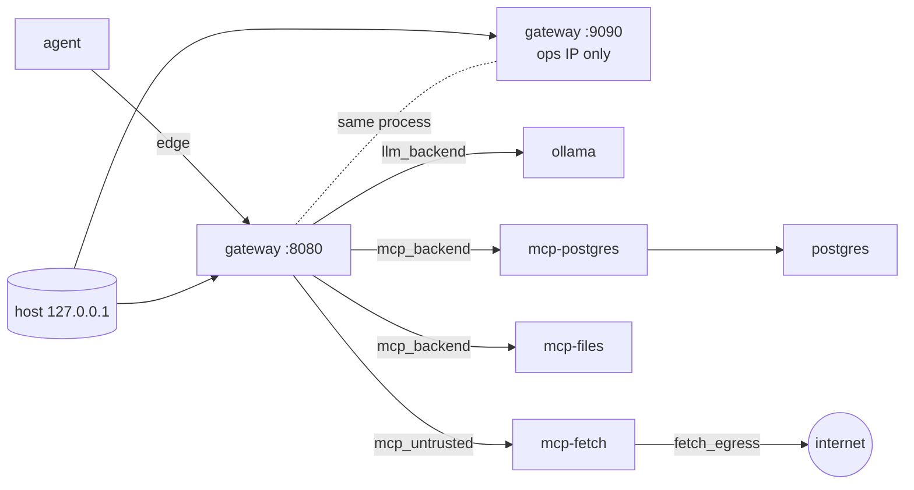

# Demo stack

`docker-compose.yml` at the repo root runs the gateway with its demo upstreams. Everything in
this directory belongs to that stack:

| Path | What it is |
| --- | --- |
| `identities.yaml` | The principals `POST /auth/demo-token` may issue tokens for, with each one's roles, mode and default agent |
| `db/` | Postgres init: the `sales` schema, roles, row-level security and a small seed |
| `mcp_servers/` | One image that serves the three MCP upstreams: `postgres`, `fetch`, `files` |
| `agent/` | The agent container: it can reach only the gateway (it idles for now) |

## Running it

```sh
cp .env.example .env                                # replace every secret in .env
docker compose --profile init run --rm ollama-init  # one-off model pull (OLLAMA_MODEL, several GB)
docker compose up -d --build
```

`ollama-init` is the only way a model gets into the `ollama_models` volume. It runs on the
temporary `bootstrap` network, which has internet access. The `ollama` service itself sits on
`llm_backend` only, so it has no way out. Pull the model before `up`, or stop `ollama` while
pulling, so two processes don't write the volume at once.

If 9090 or 8080 is already taken on your machine, set `ACL_OPERATOR_HOST_PORT` or
`ACL_AGENT_HOST_PORT` in `.env`. Both ports are always published on `127.0.0.1` only.

## Network topology



| Network | Internal | Members |
| --- | --- | --- |
| `edge` | yes | agent, gateway |
| `ops` | no | gateway (static `172.29.90.10`); later Prometheus, Loki, Grafana |
| `llm_backend` | yes | gateway, ollama |
| `mcp_backend` | yes | gateway, mcp-postgres, mcp-files, postgres |
| `mcp_untrusted` | yes | gateway, mcp-fetch |
| `fetch_egress` | no | mcp-fetch only |
| `bootstrap` | no | ollama-init only (profile `init`) |

Two choices are worth spelling out:

- **The operator listener binds the gateway's `ops` IP, not `0.0.0.0`.** A socket on
  `0.0.0.0` answers on every network the container joins. The agent on `edge` could then call
  `/auth/demo-token`. The gateway reads its bind addresses from `ACL_AGENT_HOST`/`ACL_AGENT_PORT`
  and `ACL_OPERATOR_HOST`/`ACL_OPERATOR_PORT`, and compose sets the operator host to the static
  `ops` address.
- **`mcp_untrusted` is internal, and mcp-fetch reaches the internet through `fetch_egress`.**
  Docker sends a container's published ports to its default-route network. That has to be
  `ops`, the gateway's only non-internal network. If `mcp_untrusted` carried the internet route,
  Docker could pick it instead, and the operator listener would not be reachable from the host.
  The property the SPEC asks for still holds: only the fetch server has internet access, and it
  shares no network with Postgres or Ollama.

`tests/bypass/` checks all of this. The static tests read `docker compose config`. The
`docker`-marked tests run against a running stack. They send TCP probes from inside the agent and
mcp-fetch containers to every protected container's real IP on every network it joins, with
positive controls from the gateway. They also call the `fetch` tool with internal URLs:

```sh
pytest tests/bypass -m "not docker"         # static, needs only the docker CLI
ACL_DOCKER_TESTS=1 pytest tests/bypass      # also the live probes (stack must be up)
```

## Identities (`identities.yaml`)

```yaml
identities:
  <sub>:                      # JWT `sub`: user@demo, or svc:<agent> for autonomous agents
    roles: [<role>, ...]      # roles from policy.yaml
    mode: interactive | autonomous   # must equal the default agent's registered `type`
    default_agent: <agent>    # JWT `act.sub` unless the token request names another agent
    description: <text>       # a note for people; never used in a decision
```

| Principal | Role | Default agent | Customers visible (RLS) |
| --- | --- | --- | --- |
| `anna@demo` | analyst | databot | 40 (north, south, east) |
| `bartek@demo` | intern | databot | 7 (east) |
| `olga@demo` | ops-team (approver) | databot | 0 |
| `root@demo` | admin | databot | 50 |
| `svc:nightly_etl` | none (autonomous; grants come from the agent's `allow`) | nightly_etl | 50 |

## Database (`db/`)

`00_init.sh` runs once, on an empty `pgdata` volume. It must stay executable (git mode 100755).
It applies `sql/01_schema.sql` and `sql/02_seed.sql`:

- `sales_owner` owns everything and cannot log in. `acl_app` is the role mcp-postgres connects
  as: not the owner, no `SUPERUSER`, no `BYPASSRLS`, `SELECT` only.
- `sales.customers`, `sales.orders` and `sales.payments` have `ENABLE` + `FORCE ROW LEVEL
  SECURITY`. Which customers you see depends on `current_setting('app.user_id', true)`, matched
  against `acl.region_access`. Orders and payments follow the customers you can see. An unset
  user sees no rows.
- `acl.region_access` lives outside `sales`, so a `read:db:sales.*` grant never covers it.

To re-seed: `docker compose down -v`, or remove the `pgdata` volume.

## MCP upstreams (`mcp_servers/`)

Each upstream is built on the official MCP Python SDK (`mcp==2.3.0`). In 2.x, `FastMCP` is
called `MCPServer`. Each one serves streamable HTTP on `0.0.0.0:8000/mcp`, and the compose
`command` picks which server runs.

| Service | Tool | Notes |
| --- | --- | --- |
| `mcp-postgres` | `query(sql)` | Verifies `X-ACL-Principal`, then runs the statement in one read-only transaction that starts with `set_config('app.user_id', principal, true)`. Exactly one statement runs (extended protocol). Without a valid principal, nothing runs. |
| `mcp-files` | `write_report(name, content)` | Plain file names only. Creates files only (O_EXCL, so it never overwrites or follows a symlink). Writes under the `reports` volume at `/data/reports`. |
| `mcp-fetch` | `fetch(url)` | http(s) GET on port 80/443 only, with a 10 s timeout and a 256 KiB cap. It resolves the host itself and refuses the call if any answer is not a public address (loopback, private, CGNAT, link-local/metadata, ULA, multicast, and IPv4-mapped/6to4 forms of those). It then connects to the validated IP, keeping the original Host header and TLS SNI, so DNS rebinding can't redirect the connection. It does not follow redirects: the agent has to fetch the new URL through the gateway. |

Tool annotations (`readOnlyHint`, `destructiveHint`, ...) are only hints. The gateway's operator
mapping in `policy.yaml` decides what each tool means.

### `X-ACL-Principal`

The gateway sends this header to mcp-postgres on every call. It holds an HS256 JWT signed with
`ACL_INTERNAL_KEY`. Only the gateway and mcp-postgres have that key. It is not the agent signing
key, and it is never the agent's bearer token.

| Claim | Value |
| --- | --- |
| `iss` | `ai-control-layer` |
| `aud` | `mcp-postgres` |
| `sub` | the authenticated principal, e.g. `anna@demo` |
| `iat`, `exp` | `exp - iat <= 60` seconds |

The signature matters even on an internal network: mcp-files also sits on `mcp_backend`, and
without the key it cannot make the database act as another user.

### Developing the servers

```sh
cd demo/mcp_servers
uv run pytest                      # unit tests: report paths, principal verification, fetch SSRF
uv run --with pyright pyright      # strict
```
