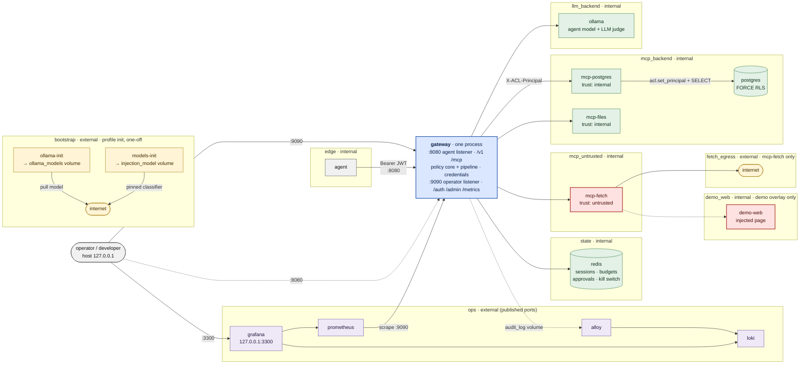
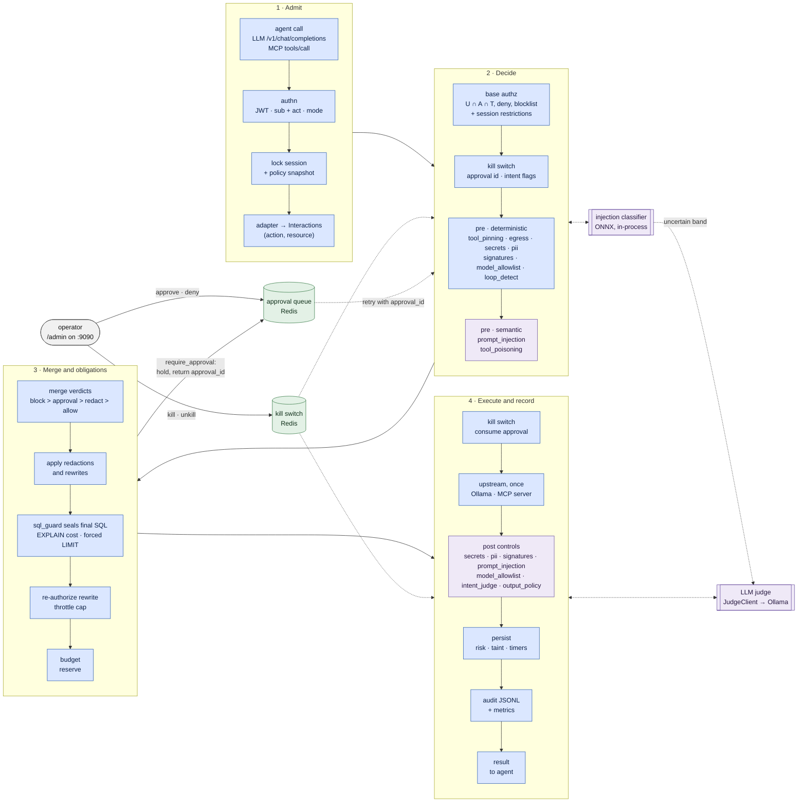
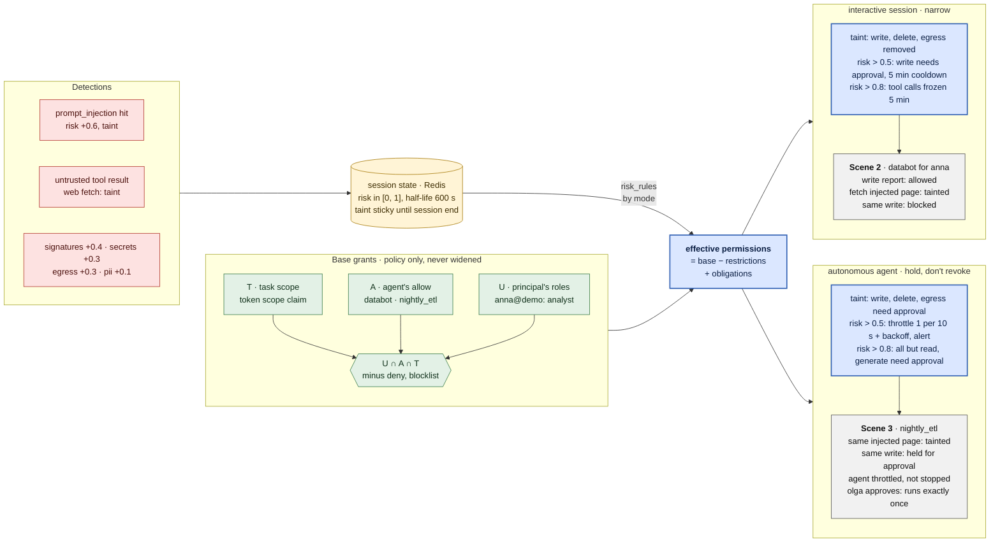

# Architecture

The AI Control Layer is one gateway process with two entry points, an OpenAI-compatible LLM
proxy (`/v1`) and an MCP proxy (`/mcp`), in front of a shared policy core. Every model call and
every tool call goes through the same pipeline and reads and writes the same session state. A
detection on one channel therefore changes what the agent may do on the other. `SPEC.md` is the
source of truth. This page explains the shape of the running system in three pictures.

Rendered copies of the diagrams (SVG, and PNG at 2x, each in a light and a `-dark` variant) live
in [`img/architecture/`](img/architecture/). `make diagrams` re-renders them from this file.

## System context and network topology

The agent can reach exactly one thing: the gateway's agent listener on the internal `edge`
network. The upstreams sit on internal networks that they share only with the gateway, grouped
by trust, so the agent reaches none of them and a compromised fetch server cannot reach
Postgres, Ollama or Redis. The gateway joins `edge`, `ops`, `llm_backend`, `mcp_backend`,
`mcp_untrusted` and `state`; each arrow from it enters the network its target sits on. `ops`
is not internal because it carries the two published ports, the operator listener and Grafana,
both bound to `127.0.0.1`. Apart from `ops`, only mcp-fetch (through `fetch_egress`) and the
one-off `bootstrap` jobs have an internet route. The demo overlay `demo/compose.demo.yml` adds
`demo-web`, which serves the page with the hidden injection, on an internal `demo_web` network
it shares only with mcp-fetch (dashed). The sources of truth are `docker-compose.yml` and that
overlay, and `tests/unit/test_architecture_doc.py` fails if one of their services or networks
is missing from this diagram.

<!-- topology diagram: every compose service and network must appear in it (tests/unit/test_architecture_doc.py) -->

The network details (which service holds which secret, why the operator listener binds the
`ops` address instead of `0.0.0.0`, why `mcp_untrusted` is internal) are in
[`demo/README.md`](../demo/README.md#network-topology). `tests/bypass/` checks the topology from
inside the agent and mcp-fetch containers.

## Request pipeline

Both channels run the same steps in `gateway/pipeline.py`; the channel only decides the adapter
and the upstream. Every step reads the one policy snapshot taken when the call was admitted, and
the session stays locked until the outcome is persisted, so the next call already sees the new
risk and taint. Once the token is verified, a refusal at any step is still persisted and audited, with the
risk its verdicts add. The classifier and the LLM judge sit inside the semantic controls, the
approval queue behind the merge, and the kill switch is checked at admission, right before
dispatch and again before the result is released.

The two channels differ only at the edges of this flow:

- **LLM.** The adapter yields one `generate:model:<name>` interaction. Post controls check the
  model that actually answered, and `intent_judge` compares each `tool_call` with the user's
  goal. It never holds the response: it flags the call in the session, and the matching MCP
  `tools/call` then needs approval (the intent-flag check in step 2). With `stream: true` the
  upstream call is still buffered, and SSE is re-emitted after the post controls.
- **MCP.** The adapter maps the tool through the operator-owned mapping in `policy.yaml`. An SQL
  query yields one interaction per table, and `sql_guard` gets its plan cost from the gateway-only
  `explain` tool on mcp-postgres. A result from a `trust: untrusted` server, such as the web
  fetch, taints the session even when it is blocked. The taint is persisted before the result
  is released.

## The thesis: a detection reshapes permissions

Base permissions come only from the policy: the principal's grants, the agent's grants and the
task scope, intersected per concrete `(action, resource)`. Nothing at runtime widens them, and
an approval never grants anything outside them. Detections feed a session state instead. Risk
decays with a half-life, and taint stays until the session ends. The session's mode then
decides what that state does: an interactive session loses actions, while an autonomous agent
keeps its grants but is throttled and sent to human approval. Demo scenes 2 and 3 run the same
injected page through both modes.

The rules come from `risk_rules` in `config/policy.yaml`, one list per session mode, and do not
depend on the strictness profile. Timers never extend themselves. A cooldown starts when a call
is denied above the threshold, a freeze starts when risk first crosses 0.8, and either one
applies again only if risk is still above its threshold when it ends. Only a human can disable
an agent permanently, with the kill switch. The audit entry of every call records its
`effective_scope`, `risk` and `taint`, so Grafana's Session trace dashboard shows these
transitions as they happen.
