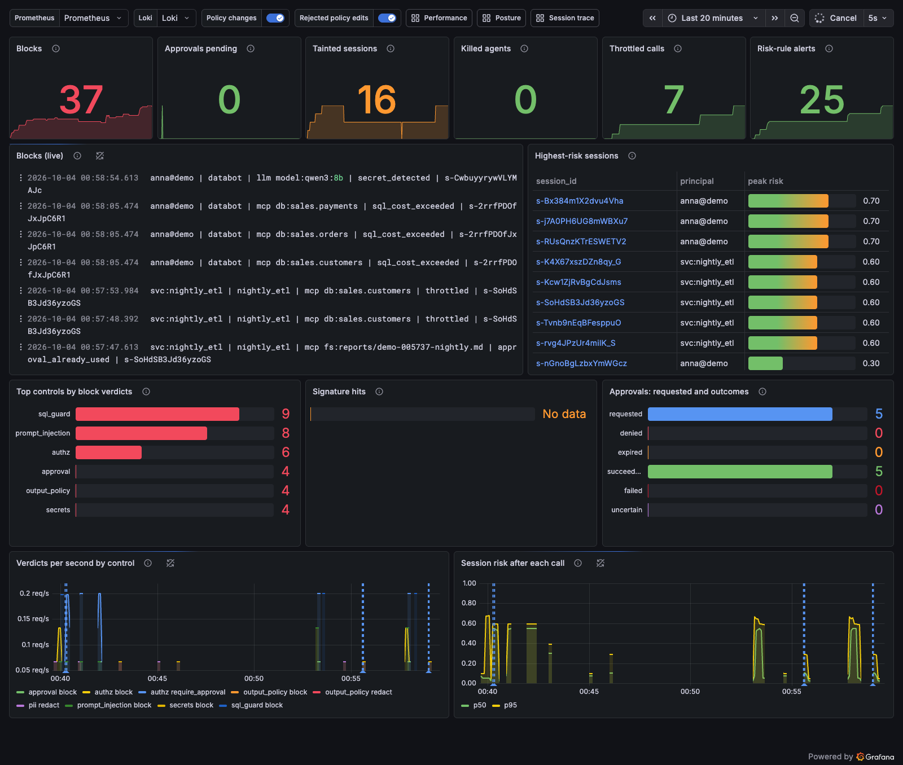
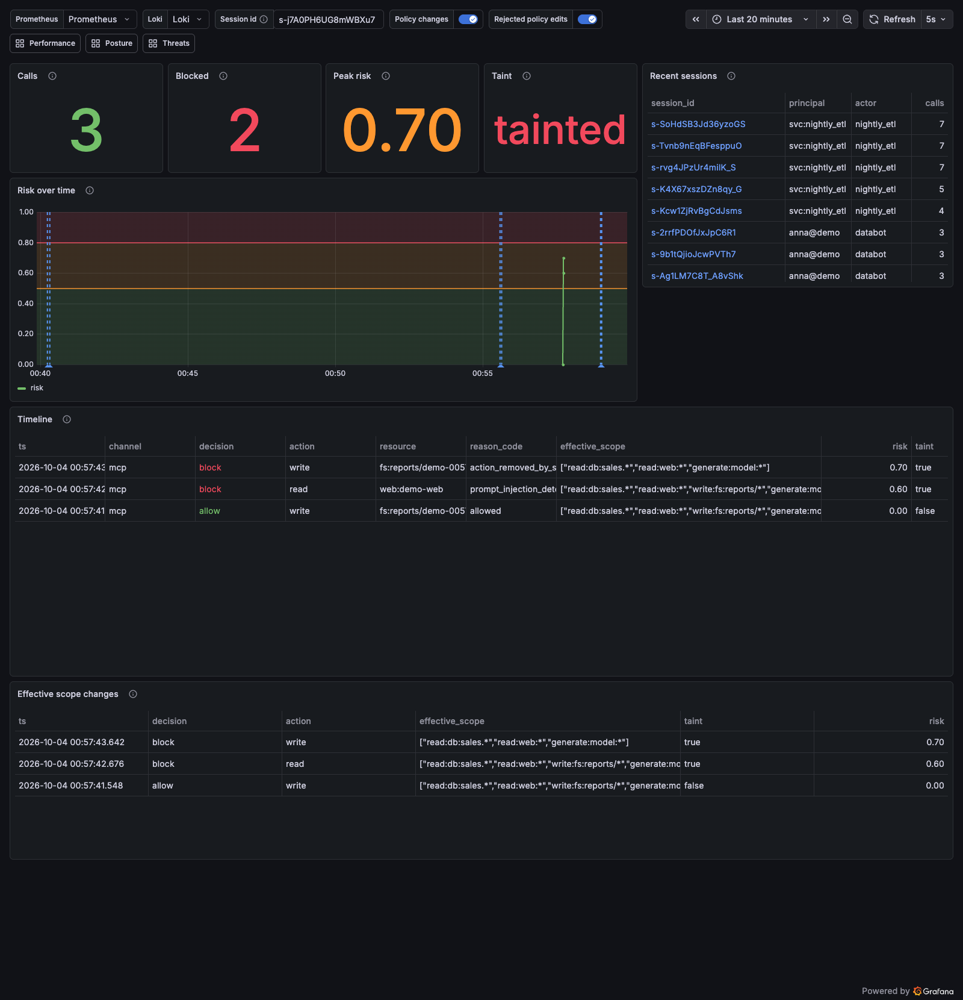

# Demo

The demo runs the seven steps of SPEC "Demo script" against the live compose stack:
`make demo`. One orchestrator (`demo/run_demo.py`) plays every scene in order. It prints a
narrated transcript showing who acts, what is sent, what the gateway decided with its
`reason_code`, and the matching audit entry. It also checks each outcome: if any scene
deviates, the run exits 1, so `make demo` doubles as an end-to-end check.

- **Agent actions run inside the `agent` container.** That container sits on the `edge`
  network only. Each action is one `docker compose exec -T -e ACL_TOKEN agent python -m
  acl_agent ...` call. `demo/agent/acl_agent/` is DataBot, a small httpx client that speaks MCP
  (streamable HTTP on `/mcp/{server}`) and OpenAI chat (`/v1/chat/completions`) to
  `http://gateway:8080` and to nothing else. The bearer token arrives through the environment,
  never the command line.
- **Operator actions run on the host.** These are demo tokens, approvals, policy edits,
  `EXPLAIN` and audit reads. They go to the operator API on `127.0.0.1:${ACL_OPERATOR_HOST_PORT}`
  and through `docker compose exec` into the gateway (audit JSONL) and Postgres.

A full run takes 1.5 to 4 minutes. Scene 5 is the only one that waits for the CPU model.
Measured timings are in [Recorded run](#recorded-run).

## Prerequisites

```sh
cp .env.example .env                                  # replace every secret
docker compose --profile init run --rm ollama-init    # qwen3:8b into the ollama volume (~5 GB)
docker compose --profile init run --rm models-init    # injection classifier (~750 MB, pinned)
make demo-up                                          # stack + demo overlay, waits until healthy
```

If 9090, 8080 or 3300 is taken on your machine, set `ACL_OPERATOR_HOST_PORT`,
`ACL_AGENT_HOST_PORT` or `ACL_GRAFANA_HOST_PORT` in `.env`. `make demo` and `run_demo.py` read
the same values. Grafana's login is `admin` with `ACL_GRAFANA_ADMIN_PASSWORD` from `.env`.

Warm the model once before an audience sees it. The first LLM call after Ollama starts loads
5 GB of weights. Running `make demo DEMO_ARGS="--scene 5"` once is enough.

## Running

```sh
make demo                                   # all seven scenes, exit 1 on any deviation
make demo DEMO_ARGS="--pause"               # wait for Enter between scenes (live talk)
make demo DEMO_ARGS="--scene 2 --scene 3"   # selected scenes
uv run python -m demo.run_demo --json reports/demo.json   # per-scene results as JSON
```

The run ends with a per-scene summary (status, seconds, checks) and Grafana links: the Threats
dashboard and one Session trace link per interesting session (scene 2's tainted session,
scene 3's autonomous one, and others).

## Talk track

Each scene opens a fresh gateway session (a new token from the operator API). No scene
inherits taint, risk or budget from another.

### Scene 1: same agent, same question, different person (3 to 10 s)

**Say:** "Anna and Bartek ask DataBot the same question. The agent is the same, but the
answer depends on who is asking. Bartek's agent is also refused a table Bartek can't read."

**Audience sees:**

- Terminal: `sales_db.query(SELECT COUNT(*) ...)` returns 40 for anna and 7 for bartek. Bartek
  on `sales.payments` gets `outside_principal_scope`, and the audit line shows his effective
  scope, which has no payments.
- Grafana Threats: the block appears in Blocks (live).

The gateway forwards the principal in a signed `X-ACL-Principal` assertion, and Postgres
row-level security filters the rows. The model never decides which rows a person sees.

### Scene 2: indirect injection taints an interactive session (4 to 7 s)

**Say:** "DataBot may write reports, and it does. Then it reads a web page. The page hides an
instruction for AI assistants in a `display:none` block. The page is untrusted, so the session
is now tainted. The same write is refused for the rest of the session, and no human had to
notice anything."

**Audience sees:**

- Terminal: the first write is `ALLOWED`. `web.fetch` returns `prompt_injection_detected`, and
  its audit line shows `taint=true risk=0.60`. The second write gets
  `action_removed_by_session_risk`, and `write:fs:reports/*` has dropped out of the effective
  scope.
- Grafana: open the printed **Session trace** link for scene 2. Risk over time steps up, Taint
  flips, and Effective scope changes shows `write` removed. On Threats, the session shows up
  under Highest-risk sessions and Tainted sessions.

### Scene 3: autonomous agent, held for approval, not stopped (about 20 s)

**Say:** "The same page reaches `nightly_etl`, which runs at night with no human to ask.
Removing its rights would break the job, so its write waits for an approver instead. Olga
approves it, and that exact call runs once. A replay of the approval is refused. While risk is
high, the agent is throttled with exponential backoff: it slows down instead of failing."

**Audience sees:**

- Terminal: the write gets `approval_required` with an `approval_id`. Olga (an operator token
  with the `ops-team` approver role) lists it with `GET /admin/approvals`. The listing shows
  tool, resource and reason, plus an argument digest, never the arguments. She approves it,
  and the agent retries with `_meta["ai-control-layer/approval_id"]`, which is `ALLOWED`. The
  replay gets `approval_already_used`, and the approval's final state is `succeeded`. The next
  call is throttled first (`waited 5.5, 10.5 s on Retry-After`) and then allowed.
- Grafana Threats: Approvals pending goes up and back down, and Approvals: requested and
  outcomes and Throttled calls increase.

The same approval works from the CLI: `uv run acl approvals list` and
`uv run acl approvals approve <id>`.

### Scene 4: a query too expensive to run (1 to 3 s)

**Say:** "DataBot writes a triple cross join. sql_guard asks the planner what it would cost,
with `EXPLAIN` and never `ANALYZE`, and refuses it before Postgres does any work."

**Audience sees:**

- Terminal: `sql_cost_exceeded`. The operator then runs the same `EXPLAIN` that sql_guard runs
  (role `acl_app`, `acl.set_principal('anna@demo')`), and it reports planner cost 70,495.2
  against `max_cost` 10,000. The agent itself never sees the cost.
- Grafana Threats: `sql_guard` appears in Top controls by block verdicts.

### Scene 5: PII redacted before the model, secrets never sent (40 to 145 s)

**Say:** "This prompt contains a PESEL. The gateway masks it before the model sees it, so the
model can only work with the mask. The second prompt contains an API key. It's refused in
milliseconds, and the model is never called."

**Audience sees:**

- Terminal: the model answers `CALLER PESEL [REDACTED:PL_PESEL], INVOICE RESEND.` It was asked
  to upper-case the line, and the line it received already held the mask. The audit line
  shows `pii/pre=pii_detected` with decision `redact`. The API-key prompt gets
  `secret_detected` in about 0.1 s, and its audit line has no upstream latency.
- Grafana Posture/Threats: the `secrets` block appears.

This is the slow scene. One CPU turn (about 15 to 40 s) is followed by the `output_policy`
judge (about 10 to 25 s). Use the wait to explain the judges.

The scene checks four things. The prompt's `pii` verdict is `redact`. The model was called,
which proves it got the redacted prompt. The PESEL digits are absent from anything that came
back. And the answer was either released or withheld with `judge_unavailable`. A busy CPU can
push the `output_policy` judge past its deadline; the judge then fails closed and withholds
the answer. That outcome belongs to the judge, not to the redaction, so the transcript says
so and the scene still passes. The answer is shown whenever it is released.

### Scene 6: no way around the gateway (4 to 8 s)

**Say:** "Suppose the agent is compromised and tries to go around the gateway. From inside its
container, the gateway answers and nothing else does. Ollama, Postgres and the MCP servers
don't resolve by name and aren't reachable by IP. There's no internet either."

**Audience sees:**

- Terminal: `gateway:8080 CONNECTED`, which is the positive control. Every other target ends
  in `no connection`, either because the name doesn't resolve or because the network is
  unreachable. The IPs are each container's real addresses, read with `docker inspect` on the
  host.

`tests/bypass/` checks the same thing exhaustively, for every network and from mcp-fetch too.

### Scene 7: change the policy live (3 to 6 s)

**Say:** "Now a judge changes the rules. We raise `max_cost` in `config/policy.yaml`. The
gateway reloads without a restart. Scene 4's query now runs, and its audit entry carries the
new policy revision. Then we put the file back."

**Audience sees:**

- Terminal: the revision changes, say `f83f261412c7 -> f4e8ebf64543`, together with the
  `policy_reload` audit event that feeds Grafana's annotation. The same heavy query is
  `ALLOWED` and counts 19,200,000 rows. The audit line shows `rev=<new>`. After the restore,
  the revision is back to the original.
- Grafana Threats: two policy-change annotations, one for the edit and one for the restore.

The orchestrator writes the edited file atomically (a temporary file in `config/`, then
`os.replace`) and always restores the original bytes, even when the scene fails. The original
is also kept in `reports/.demo-policy-backup.yaml` until the restore has landed, and the next
run restores it if a run was killed half-way. `config/` is mounted as a directory, so the
gateway's watcher sees the replaced file. If the watcher hasn't reacted after 8 s, the
orchestrator calls `POST /admin/reload`.

## Why the injection page is served locally

Scenes 2 and 3 need a web page with a hidden instruction, fetched through the `web` tool. That
page lives in [`demo/web/q3-market-notes.html`](../demo/web/q3-market-notes.html). The
injection is a `display:none` block, worded so that only the injection classifier catches it,
not a feed signature. If a signature also fired, risk would cross 0.8 and freeze tools
(`tools_frozen`) instead of showing the taint rule.

The default stack refuses to fetch such a page from inside the stack, by design. Both the
gateway's `egress` control and mcp-fetch reject any destination that isn't a public address,
and every container has a private one. That is the SSRF defence. The options were:

| Option | Why not, or why |
| --- | --- |
| Host the page on the internet | The demo would depend on a site that can change, vanish or be blocked at a venue, and it would publish attack text. |
| Use a public page with injection-like text | Same dependency. A false positive (the example.com page scores 0.94) isn't a hidden injection, and claiming it is would mislead. |
| Give `demo-web` a "public" IP on a Docker network | It would lie to our own SSRF check. |
| **A demo overlay with one named exception (chosen)** | It is off by default, explicit, and visible in every audit entry. |

The overlay [`demo/compose.demo.yml`](../demo/compose.demo.yml) is applied only when it's named
on the command line (`make demo-up`). It adds three things:

1. **`demo-web`**, a static `python -m http.server` with `nobody` as its user, a read-only root
   filesystem, `cap_drop: ALL`, `no-new-privileges` and `demo/web/` mounted read-only. It sits
   alone on the internal `demo_web` network with mcp-fetch. The agent, the gateway and the
   other upstreams share no network with it, so it models "a site on the internet" reachable
   only through the fetch server.
2. **mcp-fetch** joins `demo_web` and gets `ACL_FETCH_DEMO_HOSTS=demo-web`. For that exact host
   name, the public-address rule is lifted. Ports (80/443), resolution, pinning the connection
   to the validated IP and the no-redirects rule all still apply. IP literals and every other
   name, including `demo-web.<anything>`, are still refused.
3. **The gateway** gets `ACL_EGRESS_DEMO_HOSTS=["demo-web"]`. The `egress` control passes that
   exact name after the scheme, port and `allow_hosts` checks. It answers with its own reason
   code, `egress_demo_host`, so every use shows in the audit log. It skips resolution because
   it shares no network with `demo-web` and couldn't resolve the name anyway.

Both switches are needed. Each defaults to empty, and the unit tests pin that default: without
the overlay, `http://demo-web/` is `egress_private_address` at the gateway and
`DisallowedDestinationError` at mcp-fetch (`tests/unit/test_egress_demo_hosts.py`,
`demo/mcp_servers/tests/test_fetch_server.py`). Nothing else changes. The page goes through
the `untrusted` server like any web page: its result taints the session, and the classifier
reads hidden elements because it keeps them on purpose.

## Resetting between runs

Nothing needs resetting. Each scene mints new tokens, so it gets new sessions, budgets and
taint, and report file names carry the run's time (`demo-<HHMMSS>-*.md`). Approvals expire on
their own. Two things persist on purpose:

- The `reports` volume collects the demo's report files. Remove them with
  `docker compose exec mcp-files sh -c 'rm -f /data/reports/demo-*.md'` if you want a clean
  listing.
- The throttle window is per agent and lasts about 10 s, so wait a few seconds before
  re-running scene 3 on its own.

To return to the default stack (no `demo-web`, no demo allowances): `make demo-off`.

## If the LLM is slow

On CPU, `qwen3:8b` produces about 2.4 tokens/s, and the machine's other load matters. A busy
host has stretched one turn to 40 s and pushed the `output_policy` judge past its 40 s deadline.
The judge then fails closed and the gateway answers `judge_unavailable`.

- Scene 5 retries once with a new session when the first attempt ends in `judge_unavailable`,
  and says so in the transcript. If the retry is withheld too, the transcript explains it and
  the redaction checks still decide the scene. Scene 5 is the only LLM scene.
- Warm the model first (see Prerequisites), and close heavy local workloads before presenting.
- If it is still too slow, run `make demo DEMO_ARGS="--scene 1 --scene 2 --scene 3 --scene 4
  --scene 6 --scene 7"` and show scene 5 from the recording (`docs/demo.cast`). The
  secret-blocking half of scene 5 never waits for the model.
- Every agent request sends `reasoning_effort: "none"` and a small `max_tokens` (40). Without
  them qwen3 thinks for minutes.

## Recorded run

[`demo.cast`](demo.cast) is an asciinema recording of a full `make demo` (play it with
`asciinema play docs/demo.cast`). Playback shortens pauses longer than 5 s. The recording was
made on a laptop under other load, with `qwen3:8b` on CPU in Docker.
[`demo-transcript.txt`](demo-transcript.txt) is the same run as plain text. Its summary:

| Scene | Seconds | Checks |
| --- | ---: | --- |
| 1. Same agent, same question, different person | 2.6 | 3/3 |
| 2. Indirect injection taints an interactive session | 3.6 | 4/4 |
| 3. Autonomous agent: held for approval, not stopped | 20.8 | 7/7 |
| 4. A query too expensive to run | 1.1 | 2/2 |
| 5. PII redacted before the model, secrets never sent | 49.0 | 6/6 |
| 6. No way around the gateway | 4.1 | 8/8 |
| 7. Change the policy live, same request, new verdict | 2.9 | 3/3 |
| **Total** | **84.1** | **33/33** |

Scene 3's 20 s is mostly the throttle backoff: the agent waited 5.5 s and then 10.5 s on
`Retry-After`. Scene 5's time is the CPU model and its judge. Earlier runs on the same machine
took 2.5 to 10 s for scene 1 (the first `docker compose exec` is slower). Scene 5 took up to
145 s when both attempts waited out the 40 s judge deadline.

Screenshots taken after the run:

| Threats | Session trace (scene 2, tainted) |
| --- | --- |
|  |  |
