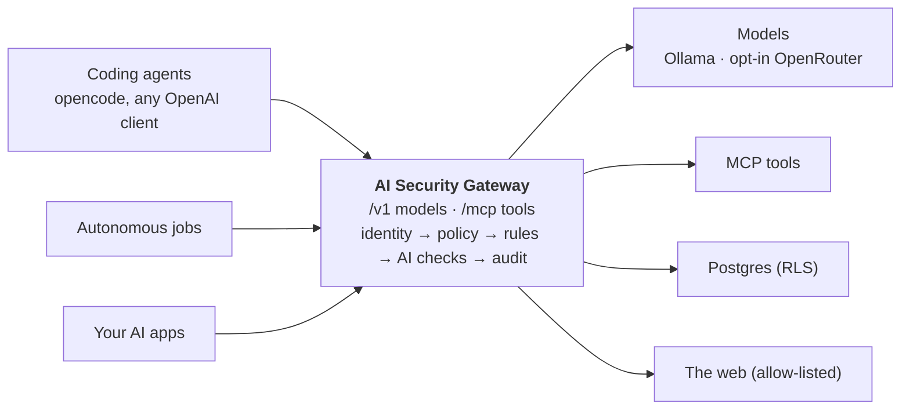

---
hide:
  - navigation
  - toc
---

# AI Security Gateway { .sr-title }

{ .logo }

One gateway in front of any model and any tool.

A self-hosted control layer that every agent call passes through, to LLMs and to MCP tools.
Rules and AI checks decide each call. One attack changes what the agent may do for the rest of the session.

[Run it in 5 minutes](getting-started.md){ .md-button .md-button--primary }
[How it works](concepts.md){ .md-button }
[GitHub](https://github.com/JMadejczyk/ai-security-gateway){ .md-button }

  
<b>15</b>controls · 11 rules + 4 AI

  
<b>3,034</b>tests, allow and deny

  
<b>1.6 ms</b>p95 rule checks (benchmark)

  
<b>100%</b>local by default

  <iframe src="https://www.youtube-nocookie.com/embed/vws1KhS0DEI?rel=0" title="AI Security Gateway showcase"
    allow="accelerometer; clipboard-write; encrypted-media; gyroscope; picture-in-picture; fullscreen"
    referrerpolicy="strict-origin-when-cross-origin" allowfullscreen loading="lazy"></iframe>

## Why

AI agents now act with your access: they read databases, browse the web and call tools. An
agent acting for a person must not inherit everything that person can do, and a poisoned web
page must not turn it against you. Firewalls and API keys see none of this.

-   :material-account-key: **Identity down to the data**

    Every call carries two identities, the user and the agent. Rights are
    *user ∩ agent ∩ task*, enforced all the way to Postgres row-level security.

-   :material-biohazard: **One attack taints the session**

    A hidden instruction in a page doesn't just get one request blocked. The session loses
    write and egress rights; autonomous jobs are throttled and routed to human approval.

-   :material-scale-balance: **Hybrid defense**

    Fast deterministic rules (secrets, PII, SQL cost, egress, signatures, budgets) plus local
    AI checks (injection classifier, tool poisoning, intent and output judges).

-   :material-file-cog: **One policy file, live**

    Controls, thresholds, block vs redact, allowed models and budgets in one `policy.yaml`.
    Hot reload, default deny, every revision on record.

-   :material-chart-box: **Reporting for both audiences**

    Grafana dashboards for posture, threats, cost and per-session traces, plus a JSONL
    audit trail of why each decision was made.

-   :material-test-tube: **Proven both ways**

    Each control has passing *allowed* and *blocked* tests; a 73-case attack corpus;
    `make test` in about 90 seconds.

## How it fits

Agents change one base URL. Upstreams are reachable only through the gateway, and anything the
policy doesn't allow is denied. Read the [architecture](architecture.md) for the network
topology and the request pipeline.
